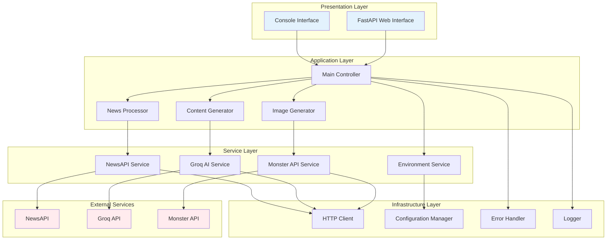
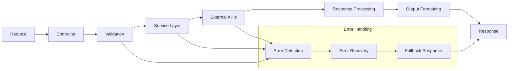
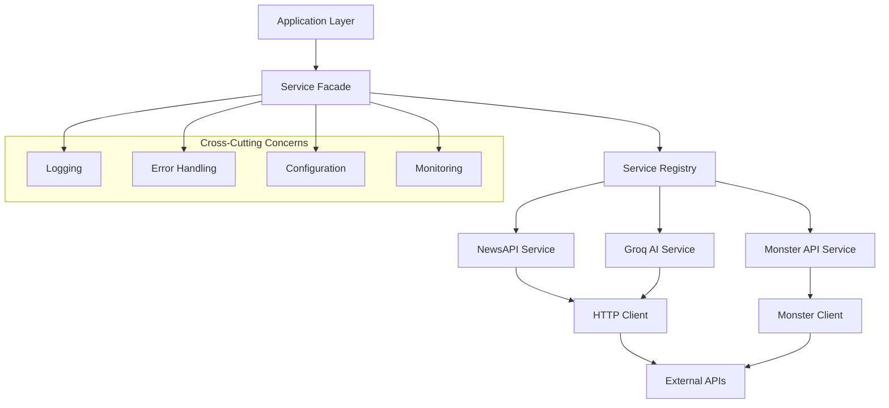
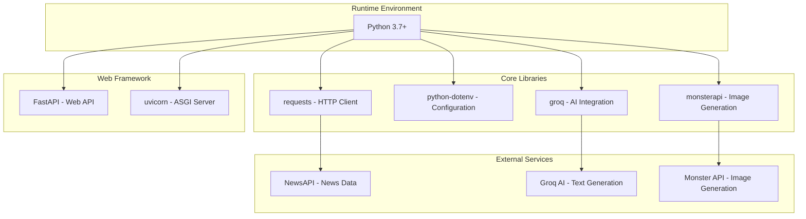
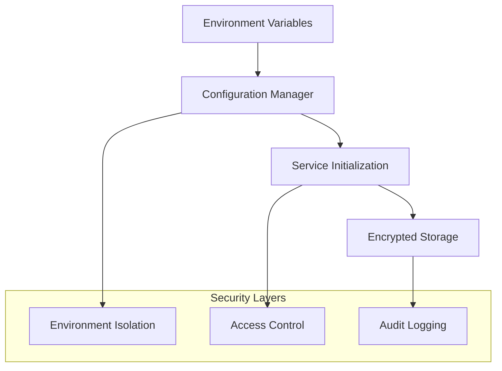
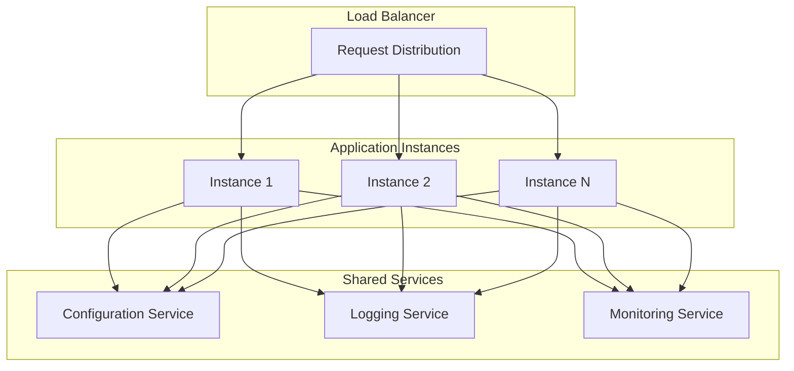
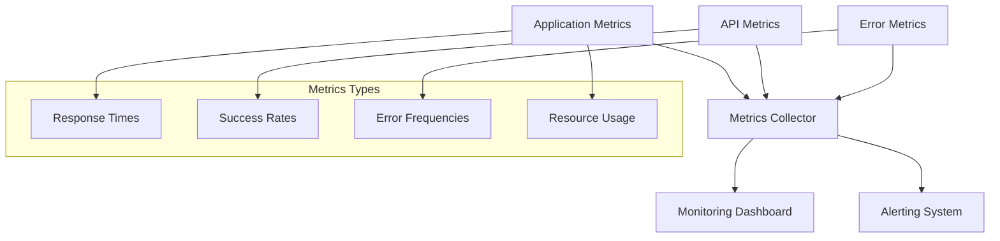
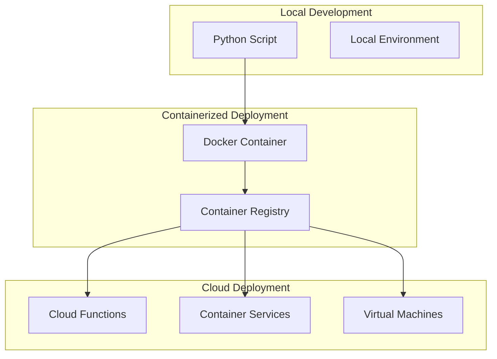

# Doctor Post Agent - Project Architecture Documentation

## 🏗️ Architecture Overview

The Doctor Post Agent is designed as a modular, API-driven system that follows a layered architecture pattern. This document provides a comprehensive view of the system's architectural components, design patterns, and technical decisions.

## 🎯 Architectural Principles

### Core Design Principles
1. **Separation of Concerns**: Each module handles a specific responsibility
2. **API-First Design**: External services integration through well-defined APIs
3. **Error Resilience**: Graceful handling of external service failures
4. **Modularity**: Loosely coupled components for maintainability
5. **Scalability**: Design supports future enhancements and scaling

### Design Patterns Used
- **Factory Pattern**: API client initialization
- **Strategy Pattern**: Different content generation strategies
- **Pipeline Pattern**: Sequential data processing stages
- **Facade Pattern**: Simplified interface for complex API interactions

## 🏛️ System Architecture Diagram



## 📦 Component Architecture

### 1. Presentation Layer

#### Console Interface (`main.py`)
```python
class ConsoleInterface:
    """
    Primary interface for command-line interaction
    Responsibilities:
    - User interaction management
    - Output formatting and display
    - Process orchestration
    """
    
    def __init__(self):
        self.controller = MainController()
    
    def run(self):
        # Main execution flow
        pass
```

#### FastAPI Web Interface (`api.py`)
```python
class WebInterface:
    """
    Web-based interface for HTTP API access
    Responsibilities:
    - HTTP request handling
    - JSON response formatting
    - API endpoint management
    """
    
    def __init__(self):
        self.app = FastAPI()
        self.controller = MainController()
```

### 2. Application Layer

#### Main Controller
```python
class MainController:
    """
    Central orchestrator for the application workflow
    Responsibilities:
    - Workflow coordination
    - Service integration
    - Business logic execution
    """
    
    def __init__(self):
        self.news_processor = NewsProcessor()
        self.content_generator = ContentGenerator()
        self.image_generator = ImageGenerator()
    
    def generate_post(self, category=None):
        # Main business logic
        pass
```

#### Content Generator
```python
class ContentGenerator:
    """
    Handles AI-powered content generation
    Responsibilities:
    - Caption generation
    - Prompt engineering
    - AI model interaction
    """
    
    def __init__(self, groq_service):
        self.groq_service = groq_service
    
    def generate_caption(self, article_data):
        # Caption generation logic
        pass
    
    def generate_visual_prompt(self, caption):
        # Visual prompt creation
        pass
```

#### Image Generator
```python
class ImageGenerator:
    """
    Manages AI image generation
    Responsibilities:
    - Image prompt processing
    - Monster API interaction
    - Image URL management
    """
    
    def __init__(self, monster_service):
        self.monster_service = monster_service
    
    def generate_image(self, visual_prompt):
        # Image generation logic
        pass
```

#### News Processor
```python
class NewsProcessor:
    """
    Handles news data acquisition and processing
    Responsibilities:
    - News fetching
    - Article selection
    - Data validation
    """
    
    def __init__(self, news_service):
        self.news_service = news_service
    
    def fetch_latest_news(self, category):
        # News fetching logic
        pass
    
    def select_article(self, articles):
        # Article selection logic
        pass
```

### 3. Service Layer

#### NewsAPI Service
```python
class NewsAPIService:
    """
    Encapsulates NewsAPI interactions
    Responsibilities:
    - API authentication
    - Request formatting
    - Response parsing
    """
    
    def __init__(self, api_key, http_client):
        self.api_key = api_key
        self.http_client = http_client
        self.base_url = "https://newsapi.org/v2"
    
    def get_everything(self, query, from_date, sort_by):
        # NewsAPI interaction
        pass
```

#### Groq AI Service
```python
class GroqAIService:
    """
    Manages Groq AI API interactions
    Responsibilities:
    - Model configuration
    - Prompt formatting
    - Response processing
    """
    
    def __init__(self, api_key, http_client):
        self.api_key = api_key
        self.http_client = http_client
        self.base_url = "https://api.groq.com/openai/v1"
        self.model = "llama-3.3-70b-versatile"
    
    def chat_completion(self, messages):
        # Groq AI interaction
        pass
```

#### Monster API Service
```python
class MonsterAPIService:
    """
    Handles Monster API for image generation
    Responsibilities:
    - Client initialization
    - Image generation requests
    - Response handling
    """
    
    def __init__(self, api_key):
        self.client = client(api_key)
        self.model = "sdxl-base"
    
    def generate_image(self, prompt, parameters):
        # Monster API interaction
        pass
```

### 4. Infrastructure Layer

#### HTTP Client
```python
class HTTPClient:
    """
    Centralized HTTP communication handler
    Responsibilities:
    - Request/response management
    - Timeout handling
    - Retry logic
    """
    
    def __init__(self):
        self.session = requests.Session()
        self.timeout = 30
        self.max_retries = 3
    
    def get(self, url, headers=None, params=None):
        # HTTP GET with error handling
        pass
    
    def post(self, url, headers=None, json=None):
        # HTTP POST with error handling
        pass
```

#### Configuration Manager
```python
class ConfigurationManager:
    """
    Manages application configuration
    Responsibilities:
    - Environment variable loading
    - Configuration validation
    - Default value management
    """
    
    def __init__(self):
        load_dotenv()
        self.config = self._load_configuration()
    
    def _load_configuration(self):
        # Configuration loading logic
        pass
    
    def get(self, key, default=None):
        # Configuration retrieval
        pass
```

#### Error Handler
```python
class ErrorHandler:
    """
    Centralized error handling and recovery
    Responsibilities:
    - Exception management
    - Error logging
    - Graceful degradation
    """
    
    def handle_api_error(self, service_name, error):
        # API error handling
        pass
    
    def handle_validation_error(self, data, validation_rules):
        # Data validation error handling
        pass
```

## 🔄 Data Flow Architecture

### Request Processing Pipeline



### Service Integration Pattern



## 🛠️ Technology Stack Architecture

### Core Technologies


### Dependency Management
```python
# requirements.txt structure
dependencies = {
    "core": [
        "requests>=2.25.0",
        "python-dotenv>=0.19.0"
    ],
    "ai_services": [
        "groq>=0.4.0",
        "monsterapi>=1.0.0"
    ],
    "web_framework": [
        "fastapi>=0.68.0",
        "uvicorn>=0.15.0"
    ],
    "development": [
        "pytest>=6.0.0",
        "black>=21.0.0",
        "flake8>=3.9.0"
    ]
}
```

## 🔒 Security Architecture

### API Key Management


### Security Measures
1. **Environment Variable Storage**: API keys stored in `.env` files
2. **No Hardcoded Secrets**: All sensitive data externalized
3. **HTTPS Communication**: All API calls use secure protocols
4. **Input Validation**: Sanitize all external inputs
5. **Error Information Filtering**: Prevent sensitive data leakage

## 📈 Scalability Architecture

### Horizontal Scaling Opportunities


### Performance Optimization Strategies
1. **Caching Layer**: Cache news articles and generated content
2. **Async Processing**: Non-blocking API calls
3. **Connection Pooling**: Reuse HTTP connections
4. **Rate Limiting**: Respect API rate limits
5. **Circuit Breaker**: Prevent cascade failures

## 🔍 Monitoring and Observability

### Monitoring Architecture


### Key Metrics
- **API Response Times**: Track performance bottlenecks
- **Success/Failure Rates**: Monitor system reliability
- **Resource Utilization**: CPU, memory, network usage
- **Content Quality Metrics**: Generated content validation

## 🚀 Deployment Architecture

### Deployment Options


### Infrastructure Requirements
- **Compute**: Minimal CPU requirements, moderate memory
- **Network**: Reliable internet for API calls
- **Storage**: Minimal local storage needs
- **Dependencies**: Python runtime and package dependencies

## 🔮 Future Architecture Considerations

### Planned Enhancements
1. **Microservices Architecture**: Split into independent services
2. **Event-Driven Architecture**: Async message processing
3. **Database Integration**: Persistent storage for generated content
4. **API Gateway**: Centralized API management
5. **Service Mesh**: Advanced service communication

### Extensibility Points
- **Plugin Architecture**: Support for additional content sources
- **Template System**: Customizable content templates
- **Multi-Platform Support**: Additional social media platforms
- **Analytics Integration**: Content performance tracking

This architecture documentation provides a comprehensive view of the Doctor Post Agent's technical design, supporting both current functionality and future growth.
