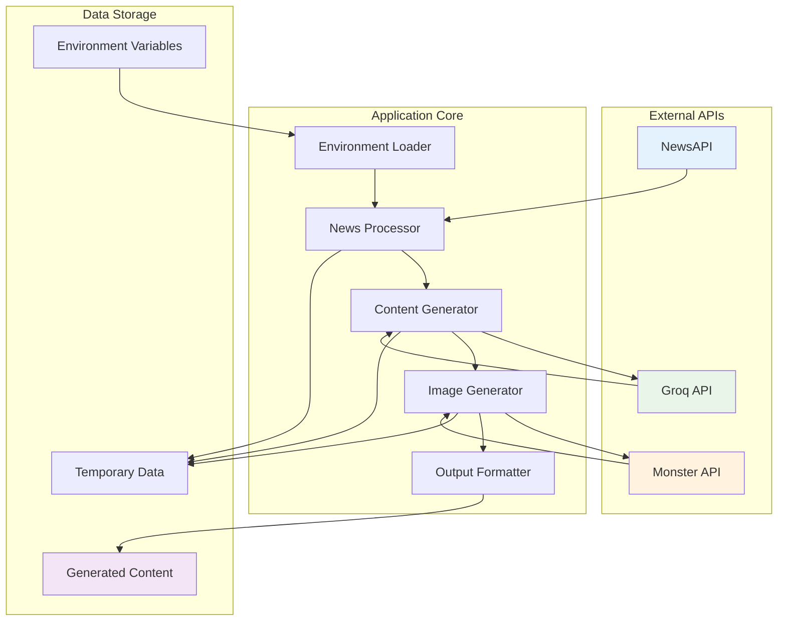
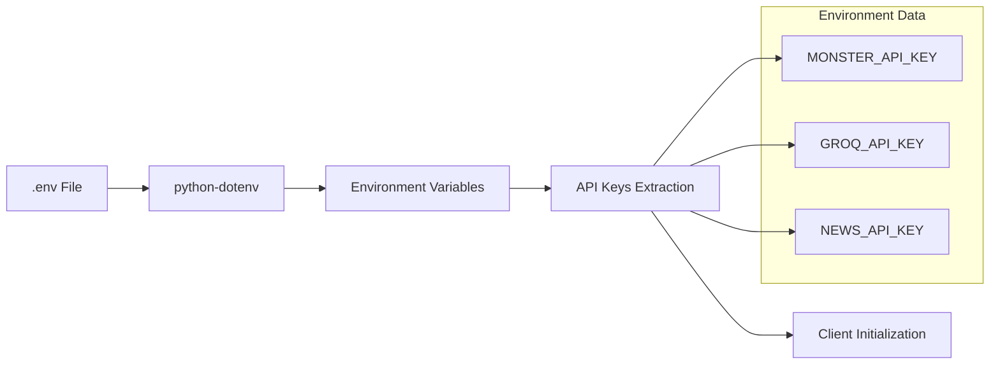
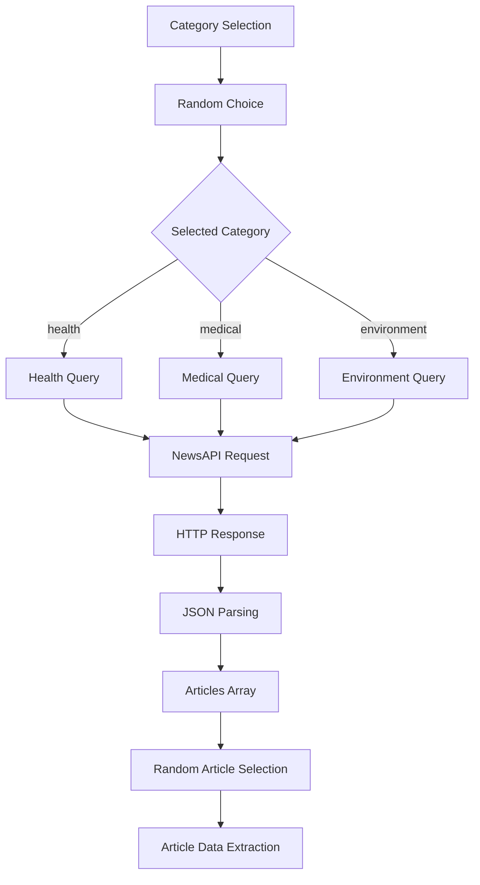
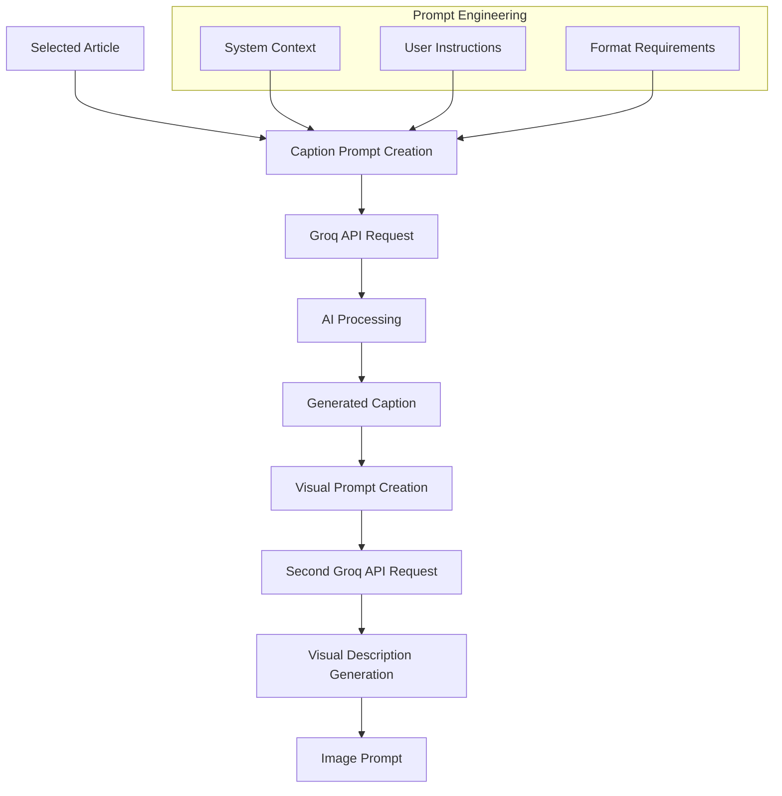
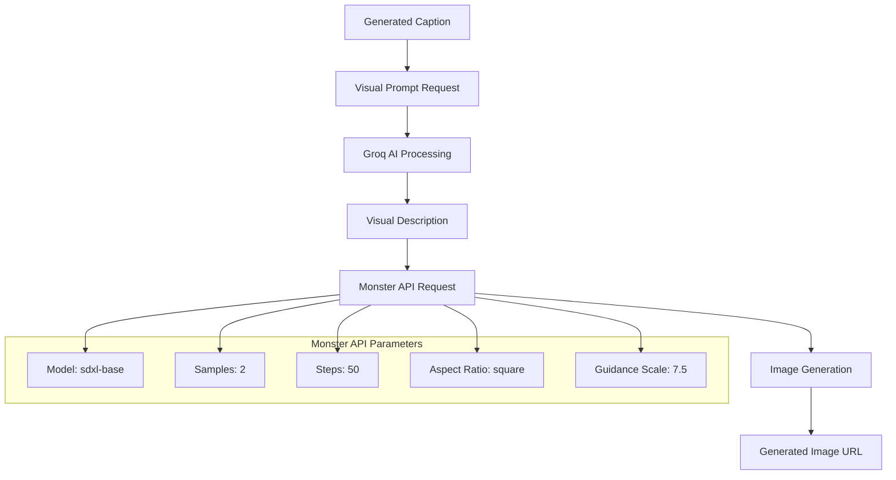
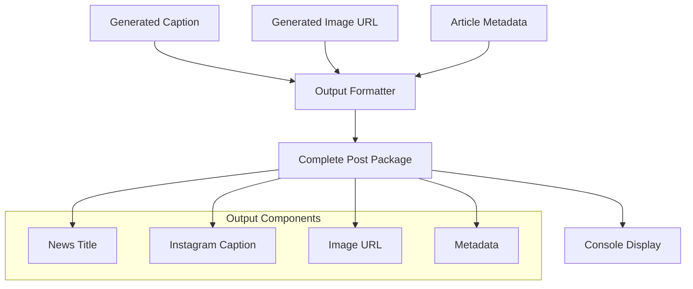
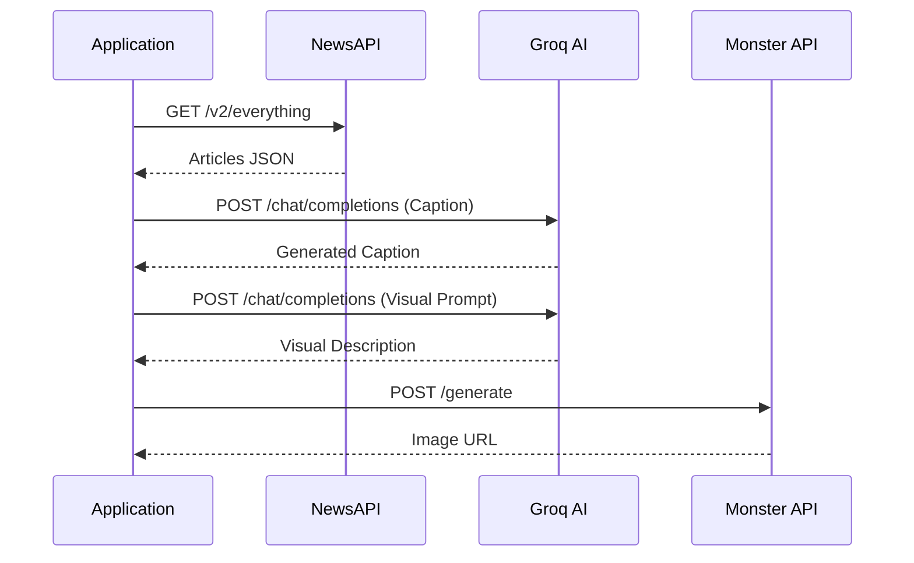

# Doctor Post Agent - Data Flow Documentation

## 📊 Data Flow Overview

This document provides a comprehensive analysis of how data flows through the Doctor Post Agent system, including data transformations, API interactions, and processing stages.

## 🔄 High-Level Data Flow Architecture



## 📈 Detailed Data Flow Stages

### Stage 1: Environment Data Loading



**Data Structure:**
```python
environment_data = {
    "MONSTER_API_KEY": "eyJ0eXAiOiJKV1QiLCJhbGciOiJIUzI1NiJ9...",
    "GROQ_API_KEY": "gsk_dRgImUOjXyQEfvrGvYa4WGdyb3FY...",
    "NEWS_API_KEY": "b080124581344a9d8ac878436e7e9d3c"
}
```

### Stage 2: News Data Acquisition



**Input Data Structure:**
```python
categories = ["health", "medical", "environment"]
selected_category = random.choice(categories)
```

**API Request Structure:**
```python
api_request = {
    "url": "https://newsapi.org/v2/everything",
    "params": {
        "q": selected_category,
        "from": "2025-04-23",
        "sortBy": "popularity",
        "apiKey": NEWS_API_KEY
    }
}
```

**Response Data Structure:**
```python
news_response = {
    "status": "ok",
    "totalResults": 1234,
    "articles": [
        {
            "title": "Article Title",
            "description": "Article Description",
            "url": "https://example.com/article",
            "publishedAt": "2025-05-27T12:00:00Z",
            "source": {"name": "Source Name"}
        }
    ]
}
```

**Processed Article Data:**
```python
selected_article = {
    "title": "Extracted Title",
    "description": "Extracted Description", 
    "url": "Article URL"
}
```

### Stage 3: Content Generation Data Flow



**Caption Prompt Structure:**
```python
caption_prompt = {
    "system_message": "You are an expert social media content creator for a doctor.",
    "user_message": f"""
    You are a creative Instagram content writer for a doctor. Write an engaging, 
    informative, and emotional Instagram Post for the following news. Use emojis, 
    2-3 relevant hashtags, and keep it under 200 words.

    Title: {article['title']}
    Description: {article['description']}
    Link: {article['url']}
    """
}
```

**Groq API Request Structure:**
```python
groq_request = {
    "model": "llama-3.3-70b-versatile",
    "messages": [
        {"role": "system", "content": system_context},
        {"role": "user", "content": user_prompt}
    ]
}
```

**Generated Caption Data:**
```python
generated_caption = {
    "content": "🏥 Breaking Health News! [Generated content with emojis and hashtags]",
    "word_count": 150,
    "hashtags": ["#HealthNews", "#MedicalUpdate", "#DoctorAdvice"]
}
```

### Stage 4: Image Generation Data Flow



**Visual Prompt Request:**
```python
visual_prompt_request = f"Create a visual prompt for an AI model to generate an Instagram-style image based on this caption:\n\n{generated_caption}"
```

**Monster API Request Structure:**
```python
monster_request = {
    "model": "sdxl-base",
    "input_data": {
        "prompt": visual_description,
        "negprompt": "blurry, cartoon, unrealistic, fantasy",
        "samples": 2,
        "enhance": True,
        "optimize": True,
        "safe_filter": True,
        "steps": 50,
        "aspect_ratio": "square",
        "guidance_scale": 7.5,
        "seed": 2414
    }
}
```

**Image Generation Response:**
```python
image_response = {
    "status": "success",
    "output": [
        "https://monster-api.com/generated-image-url-1.jpg",
        "https://monster-api.com/generated-image-url-2.jpg"
    ]
}
```

### Stage 5: Output Data Compilation



**Final Output Structure:**
```python
complete_post = {
    "metadata": {
        "category": "health",
        "date": "2025-05-27",
        "source_article": {
            "title": "Original Article Title",
            "url": "https://source-url.com"
        }
    },
    "content": {
        "caption": "Generated Instagram caption with emojis and hashtags",
        "image_url": "https://generated-image-url.com",
        "word_count": 150,
        "hashtags": ["#HealthNews", "#MedicalUpdate"]
    },
    "generation_info": {
        "caption_model": "llama-3.3-70b-versatile",
        "image_model": "sdxl-base",
        "timestamp": "2025-05-27T19:45:00Z"
    }
}
```

## 🔄 Data Transformation Pipeline

### Transformation 1: Raw News → Structured Article
```python
# Input: NewsAPI JSON Response
raw_news = response.json()

# Transformation
article = {
    "title": raw_news["articles"][0]["title"],
    "description": raw_news["articles"][0]["description"],
    "url": raw_news["articles"][0]["url"]
}
```

### Transformation 2: Article → AI Prompt
```python
# Input: Structured Article
article_data = {...}

# Transformation
ai_prompt = f"""
You are a creative Instagram content writer for a doctor...
Title: {article_data['title']}
Description: {article_data['description']}
Link: {article_data['url']}
"""
```

### Transformation 3: AI Response → Visual Prompt
```python
# Input: Generated Caption
caption = "Generated Instagram caption..."

# Transformation
visual_request = f"Create a visual prompt for an AI model to generate an Instagram-style image based on this caption:\n\n{caption}"
```

### Transformation 4: Multiple Outputs → Final Package
```python
# Inputs: Various generated content
caption = "..."
image_url = "..."
article = {...}

# Transformation
final_output = {
    "news_title": article["title"],
    "instagram_caption": caption,
    "image_url": image_url
}
```

## 📊 Data Flow Metrics

### Processing Times
- **News Fetching**: 1-3 seconds
- **Caption Generation**: 3-8 seconds
- **Image Generation**: 10-30 seconds
- **Total Pipeline**: 15-45 seconds

### Data Sizes
- **Article Data**: ~1-2 KB
- **Generated Caption**: ~500-1000 bytes
- **Image URL**: ~100-200 bytes
- **Complete Output**: ~2-4 KB

### API Call Patterns


## 🛡️ Data Validation and Error Handling

### Input Validation
```python
def validate_article_data(article):
    required_fields = ["title", "description", "url"]
    return all(field in article and article[field] for field in required_fields)

def validate_api_response(response):
    return response.status_code == 200 and response.json().get("status") == "ok"
```

### Error Recovery
```python
def handle_api_failure(api_name, error):
    fallback_responses = {
        "news": "Unable to fetch latest news",
        "caption": "Unable to generate caption",
        "image": "Unable to generate image"
    }
    return fallback_responses.get(api_name, "Unknown error occurred")
```

## 🔍 Data Flow Monitoring

### Key Metrics to Track
1. **API Response Times**: Monitor performance bottlenecks
2. **Success Rates**: Track API reliability
3. **Data Quality**: Validate generated content
4. **Error Frequencies**: Identify common failure points

### Logging Data Points
```python
log_data = {
    "timestamp": datetime.now().isoformat(),
    "category": selected_category,
    "news_api_time": news_fetch_time,
    "caption_generation_time": caption_time,
    "image_generation_time": image_time,
    "total_time": total_processing_time,
    "success": True/False,
    "errors": []
}
```

This data flow documentation provides a complete understanding of how information moves through the Doctor Post Agent system, from initial input to final output, including all transformations and processing stages.
