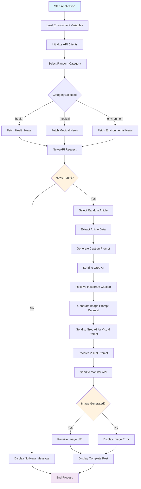
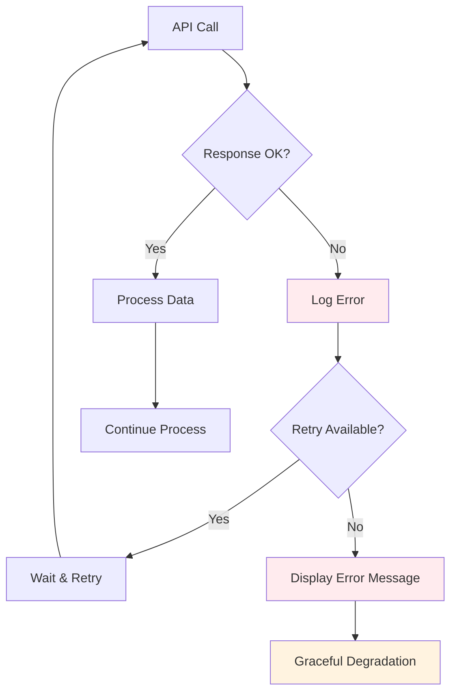
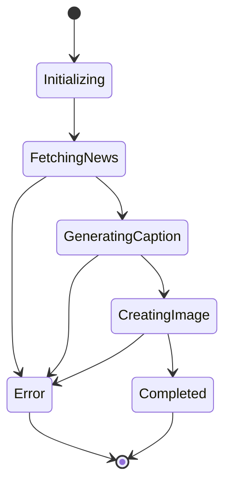
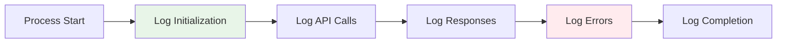

# Doctor Post Agent - Workflow Documentation

## 🔄 Complete Workflow Process

This document outlines the detailed workflow of the Doctor Post Agent system, from initialization to final output delivery.

## 📊 Workflow Diagram



## 🎯 Detailed Process Flow

### Phase 1: Initialization
1. **Environment Setup**
   - Load `.env` file using `python-dotenv`
   - Extract API keys: `MONSTER_API_KEY`, `GROQ_API_KEY`, `NEWS_API_KEY`
   - Initialize Monster API client
   - Set current date for news filtering

2. **Configuration Loading**
   - Define categories: `["health", "medical", "environment"]`
   - Set up API endpoints and headers
   - Configure model parameters

### Phase 2: Data Acquisition
1. **Category Selection**
   - Randomly select from predefined categories
   - Display selected category to user

2. **News Fetching Process**
   ```python
   # API Call Structure
   url = f'https://newsapi.org/v2/everything?q={category}&from=2025-04-23&sortBy=popularity&apiKey={NEWS_API_KEY}'
   ```
   - Make HTTP GET request to NewsAPI
   - Handle response and extract articles
   - Validate article data structure

3. **Article Selection**
   - Check if articles exist
   - Randomly select one article from results
   - Extract title, description, and URL

### Phase 3: Content Generation
1. **Caption Generation**
   - Create detailed prompt for Groq AI
   - Include article title, description, and URL
   - Specify Instagram format requirements
   - Request emojis, hashtags, and word limit

2. **Groq AI Processing**
   ```python
   # Model Configuration
   model: "llama-3.3-70b-versatile"
   system_role: "Expert social media content creator for a doctor"
   ```
   - Send structured prompt to Groq API
   - Receive AI-generated Instagram caption
   - Handle API errors and timeouts

### Phase 4: Visual Content Creation
1. **Visual Prompt Generation**
   - Send caption to Groq AI for visual interpretation
   - Request Instagram-style image description
   - Optimize prompt for image generation

2. **Image Generation Process**
   ```python
   # Monster API Configuration
   model: 'sdxl-base'
   parameters: {
       'samples': 2,
       'steps': 50,
       'aspect_ratio': 'square',
       'guidance_scale': 7.5
   }
   ```
   - Send visual prompt to Monster API
   - Generate high-quality image
   - Receive image URL

### Phase 5: Output Delivery
1. **Content Compilation**
   - Combine text caption and image URL
   - Format for social media presentation
   - Add metadata and timestamps

2. **Display Results**
   - Show selected news title
   - Display generated Instagram caption
   - Provide image URL for download
   - Handle missing components gracefully

## ⚡ Error Handling Workflow



### Error Scenarios
1. **NewsAPI Failures**
   - Network connectivity issues
   - API rate limiting
   - Invalid API key
   - No articles found

2. **Groq AI Failures**
   - Model unavailable
   - Token limit exceeded
   - Invalid prompt format
   - Response parsing errors

3. **Monster API Failures**
   - Image generation timeout
   - Invalid visual prompt
   - Service unavailable
   - Content policy violations

## 🔄 State Management

### Application States
1. **INITIALIZING**: Loading environment and clients
2. **FETCHING_NEWS**: Retrieving articles from NewsAPI
3. **GENERATING_CAPTION**: Creating text content with Groq
4. **CREATING_IMAGE**: Generating visual content with Monster API
5. **COMPLETED**: Displaying final results
6. **ERROR**: Handling failures gracefully

### Data Flow States


## 🎛️ Configuration Workflow

### Environment Variables Loading
1. Check for `.env` file existence
2. Load variables using `python-dotenv`
3. Validate required API keys
4. Set default values for optional parameters

### API Client Initialization
1. **Monster API Client**
   - Authenticate with API key
   - Set default model parameters
   - Configure timeout settings

2. **HTTP Clients**
   - Set up requests session
   - Configure headers for Groq API
   - Set timeout and retry policies

## 📈 Performance Optimization Workflow

### Caching Strategy
1. **News Caching**: Store recent articles to reduce API calls
2. **Prompt Caching**: Reuse successful prompts
3. **Image Caching**: Store generated images locally

### Async Processing Opportunities
1. **Parallel API Calls**: Fetch news while preparing prompts
2. **Background Processing**: Generate images while displaying captions
3. **Batch Processing**: Handle multiple categories simultaneously

## 🔍 Monitoring and Logging

### Logging Workflow


### Metrics Tracking
1. **API Response Times**: Monitor performance
2. **Success Rates**: Track API reliability
3. **Error Frequencies**: Identify common issues
4. **Content Quality**: Measure output effectiveness

## 🚀 Deployment Workflow

### Local Development
1. Clone repository
2. Install dependencies
3. Configure environment variables
4. Run application

### Production Deployment
1. Set up production environment
2. Configure secure API key storage
3. Implement monitoring and logging
4. Set up automated backups
5. Configure scaling policies

This workflow documentation provides a comprehensive understanding of how the Doctor Post Agent operates from start to finish, including all decision points, error handling, and optimization opportunities.
